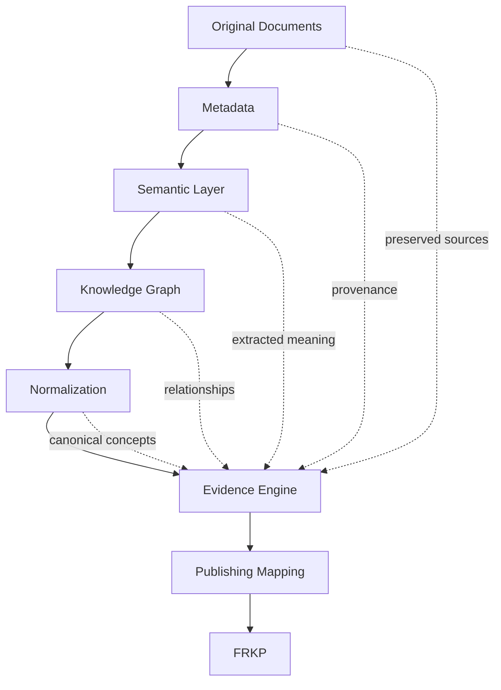
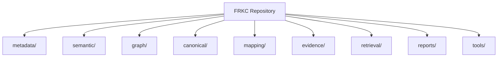
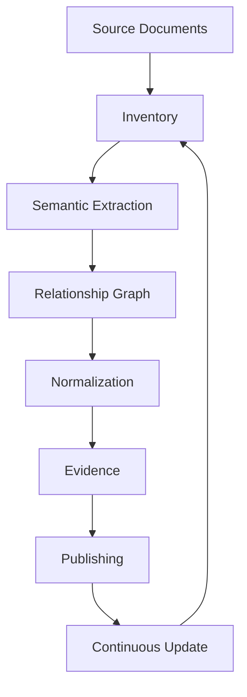
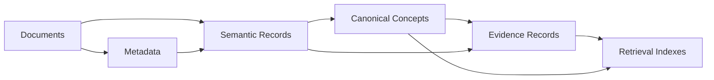
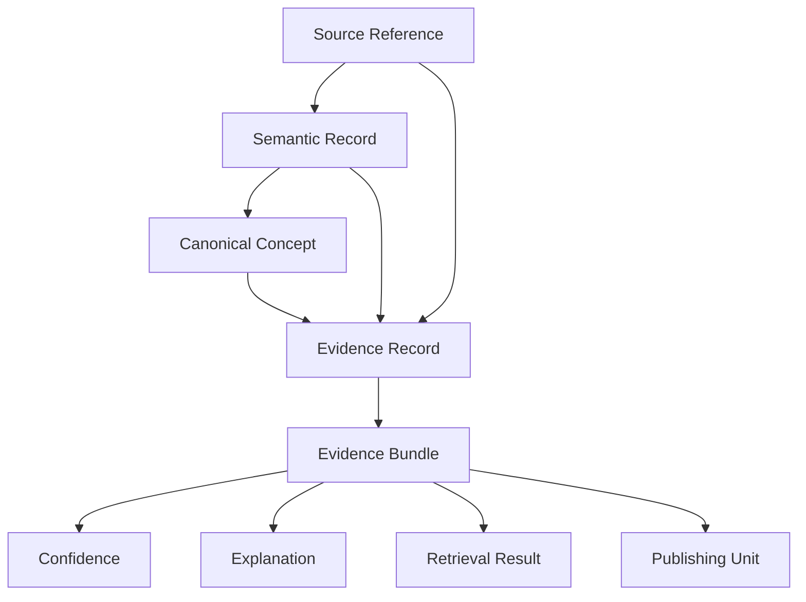
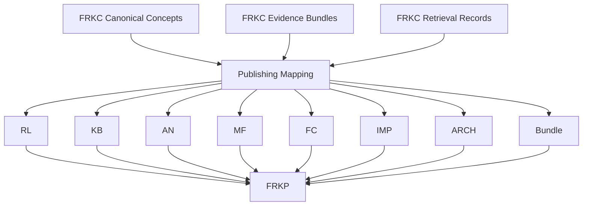

# FRKC-ARCH-001: Knowledge Corpus Architecture

## Document Information

| Field | Value |
| --- | --- |
| Document ID | FRKC-ARCH-001 |
| Document Name | Knowledge Corpus Architecture |
| Version | 1.0.0 |
| Status | Approved |

## 1. Purpose

The Financial Risk Knowledge Corpus (FRKC) exists to preserve, structure, normalize, explain, and continuously evolve authoritative financial risk knowledge. It provides the controlled knowledge foundation from which downstream products, publications, retrieval experiences, and AI-assisted workflows can be generated.

FRKC is distinct from the Financial Risk Knowledge Platform (FRKP).

FRKC is the authoritative knowledge repository. It owns source preservation, metadata, semantic records, relationship graphs, canonical concepts, evidence records, retrieval-ready knowledge structures, and publishing mappings.

FRKP is the publishing platform built on top of FRKC. It consumes curated and mapped FRKC knowledge to produce user-facing publications, knowledge products, interfaces, bundles, and operational workflows. FRKP does not replace FRKC as the source of truth.

## 2. Vision

FRKC is designed as an AI-ready knowledge corpus for financial risk knowledge. Its long-term vision is to make financial knowledge traceable, explainable, reusable, and continuously improvable.

The target state is a corpus where every important concept can be traced to preserved source material, every generated or retrieved answer can be explained by evidence, and every publication can be linked back to the canonical knowledge records that support it.

FRKC enables:

- AI-ready knowledge representation.
- Traceable financial knowledge.
- Evidence-based publishing.
- Continuous knowledge evolution.
- Canonical vocabulary management.
- Repeatable generation of derived knowledge products.
- Separation of authoritative knowledge from presentation channels.

## 3. Design Principles

### Source Preservation

Original source documents are preserved as immutable references. Processing must not overwrite, rewrite, or obscure original material.

### Traceability

Every derived record must preserve a path back to its source document, source location, source metadata, or upstream derived record.

### Canonical Knowledge

FRKC maintains canonical concepts and normalized vocabulary so that equivalent terms, aliases, abbreviations, and related expressions can be understood consistently.

### Explainability

Knowledge retrieval, publishing decisions, and generated outputs must be explainable through evidence, relationships, confidence, and source references.

### Technology Neutrality

FRKC defines logical architecture, not a specific storage engine, programming language, or deployment model.

### Reproducibility

Corpus processing should be repeatable. Given the same source inputs, configuration, and corpus version, generated outputs should be reproducible.

### Evidence First

Answers, mappings, and publications should be grounded in explicit evidence records rather than unsupported assertions.

### Additive Processing

Processing stages should add metadata, semantic records, graph relationships, canonical records, evidence, and mappings without destructively changing prior authoritative records.

### Deterministic Generation

Generated corpus artifacts should use stable rules, stable identifiers, and predictable processing behavior wherever possible.

## 4. Overall Architecture

FRKC is organized as a layered knowledge architecture. Each layer enriches the previous layer while preserving traceability to source material.

The architecture separates knowledge authority from publishing. FRKC is responsible for knowledge integrity, evidence, traceability, and canonical structure. FRKP is responsible for presenting and operationalizing mapped knowledge.

## 5. Repository Structure

FRKC uses a repository structure that separates preserved source knowledge, derived knowledge layers, evidence, retrieval assets, reports, and supporting tools.

### metadata/

Stores document inventories, document-level descriptors, provenance information, source classification, ownership context, and processing status.

### semantic/

Stores semantic records extracted from source documents, including concepts, definitions, statements, obligations, controls, formulas, assumptions, and other meaning-bearing units.

### graph/

Stores relationship structures between documents, terms, concepts, definitions, evidence records, canonical records, and publishing targets.

### canonical/

Stores normalized knowledge records, canonical concepts, preferred terminology, aliases, merged definitions, and controlled vocabulary structures.

### mapping/

Stores mappings from FRKC knowledge records to FRKP publishing categories, publication structures, bundles, and downstream knowledge products.

### evidence/

Stores evidence bundles, evidence records, supporting source references, confidence information, explanation metadata, and traceability links.

### retrieval/

Stores retrieval-oriented representations derived from authoritative FRKC records. Retrieval assets must remain traceable to evidence and source records.

### reports/

Stores corpus quality reports, inventory reports, normalization reports, coverage reports, evidence reports, and publication readiness reports.

### tools/

Stores supporting corpus processing utilities and repeatable generation workflows. Tools support the corpus but do not define the authoritative knowledge model.

## 6. Knowledge Lifecycle

Knowledge moves through FRKC as a controlled lifecycle. Each stage adds structure while preserving links to prior stages.

The lifecycle begins with source documents and document inventory. Semantic extraction identifies meaning-bearing records. Relationship graph construction connects knowledge records. Normalization establishes canonical concepts. Evidence processing grounds knowledge in source references. Publishing mapping prepares knowledge for FRKP. Continuous update cycles preserve the corpus as source material and knowledge requirements evolve.

## 7. Component Responsibilities

### KC-001 Knowledge Corpus Foundation

KC-001 establishes the foundational corpus structure, source inventory model, repository conventions, metadata baseline, and initial separation between preserved source material and derived knowledge artifacts.

### KC-002 Semantic Extraction

KC-002 extracts meaning-bearing semantic records from source documents. It identifies concepts, terms, definitions, statements, controls, assumptions, procedures, formulas, references, and other semantic units required for downstream graph and evidence processing.

### KC-003 Knowledge Relationship Graph

KC-003 creates relationship structures among documents, semantic records, terms, concepts, references, and derived knowledge artifacts. It supports navigation, dependency understanding, impact analysis, and traceable knowledge traversal.

### KC-004 Knowledge Normalization

KC-004 normalizes extracted knowledge into canonical records. It resolves aliases, abbreviations, duplicate terms, overlapping definitions, and equivalent concepts while preserving source traceability.

### KC-005 Evidence & Retrieval Engine

KC-005 establishes evidence bundles, evidence records, confidence structures, explainability metadata, and retrieval-ready representations grounded in traceable corpus knowledge.

### KC-006 Publishing Mapping

KC-006 is reserved for formal mapping from FRKC canonical and evidence-backed knowledge into FRKP publishing categories, bundles, and product structures.

### KC-007 Corpus Quality Certification

KC-007 is reserved for corpus quality scoring, certification rules, coverage validation, orphan detection, evidence completeness checks, and release readiness criteria.

### KC-008 Incremental Update Engine

KC-008 is reserved for controlled incremental updates, change impact analysis, reprocessing rules, update lineage, and version-aware corpus evolution.

## 8. Knowledge Model

FRKC knowledge is represented through connected record types.

Documents are preserved source materials or source descriptors. They provide the authoritative origin for knowledge extraction.

Metadata records describe documents, provenance, classification, processing state, source identity, and inventory status.

Semantic records capture extracted meaning from documents. They are derived from sources and must retain source references.

Canonical concepts represent normalized knowledge. They consolidate equivalent semantic records, preferred terminology, aliases, definitions, and concept relationships.

Evidence records connect claims, concepts, answers, mappings, and retrieval results to source-backed support. They include source references, rationale, confidence, and explanation context.

Retrieval indexes are derived access structures optimized for search, retrieval, and answer generation. They are not the source of truth; they must point back to canonical records, evidence, and preserved sources.

The logical relationship model is:

## 9. Evidence Architecture

The Evidence Engine grounds FRKC knowledge in source-backed support. It provides the explanation layer for retrieval, publishing, and AI-assisted use.

An evidence bundle groups evidence records that support a concept, answer, mapping, publication unit, or knowledge claim. Each bundle should contain source references, supporting semantic records, canonical concept links, confidence information, and explanation context.

Confidence expresses the assessed strength of support for a knowledge claim or mapping. Confidence should be derived from source quality, consistency, directness, coverage, and conflict status.

Explainability is achieved by connecting outputs to evidence bundles and evidence records. A user or reviewer should be able to understand which sources support a result, why those sources were selected, and how they relate to the canonical concept.

Traceability requires evidence to reference original sources directly or through preserved metadata and semantic records. Evidence must not exist as an unsupported assertion.

Source preservation ensures evidence can be audited against the original material even after additional corpus layers are created.

## 10. Publishing Architecture

FRKC supports FRKP through publishing mappings. These mappings transform canonical, evidence-backed corpus knowledge into publishing categories and bundles consumed by FRKP.

FRKP consumes mapped knowledge. It does not own canonical vocabulary, evidence authority, or source preservation.

Publishing categories are logical destinations:

- RL: Risk library publishing structures.
- KB: Knowledge base publishing structures.
- AN: Analytical note publishing structures.
- MF: Model or methodology framework publishing structures.
- FC: Formula and calculation publishing structures.
- IMP: Implementation guidance publishing structures.
- ARCH: Architecture and design publishing structures.
- Bundle: Grouped publication packages assembled from mapped knowledge.

## 11. Versioning Strategy

FRKC has its own version number because it is the authoritative knowledge corpus. Its versions identify the state of source inventory, metadata, semantic records, graph relationships, canonical concepts, evidence records, retrieval structures, and publishing mappings.

FRKP has an independent version number because it is a publishing platform. Its versions identify platform capabilities, user-facing publication behavior, presentation models, interface changes, and operational delivery.

Independent versioning allows FRKC knowledge to evolve without requiring a platform release for every corpus update. It also allows FRKP to improve publishing and user experience without changing authoritative corpus content.

A publishing release should identify both the FRKC version used as the knowledge source and the FRKP version used as the publishing platform.

## 12. Governance

FRKC governance rules are:

- Never modify original documents.
- Metadata is additive and must preserve provenance.
- Semantic records must reference source documents or source metadata.
- Canonical records must preserve traceability to semantic records and source material.
- Evidence must reference original sources directly or through traceable source-backed records.
- Retrieval structures must not become independent sources of truth.
- Publishing mappings must identify the canonical and evidence-backed records they use.
- Conflicting definitions must be represented explicitly, not silently overwritten.
- Corpus changes must preserve version history and change rationale.
- Generated artifacts must be reproducible from controlled inputs.

## 13. Future Roadmap

Planned FRKC components include:

- KC-006 Publishing Mapping: formal mapping from canonical knowledge to FRKP publication structures.
- KC-007 Corpus Quality Certification: quality scoring, coverage validation, orphan detection, and release certification.
- KC-008 Incremental Update Engine: controlled updates, change impact analysis, and reprocessing scope management.
- KC-009 AI Authoring Engine: evidence-grounded drafting, summarization, and corpus-assisted publication generation.
- KC-010 Continuous Knowledge Pipeline: ongoing ingestion, validation, normalization, evidence generation, and publishing readiness.

## 14. Risks

Architectural risks include:

- Ambiguous abbreviations that map to multiple financial risk meanings.
- Conflicting glossary definitions across source documents.
- Evidence quality variation between source materials.
- Incomplete source documents or missing provenance.
- Over-normalization that hides legitimate contextual differences.
- Retrieval outputs that appear authoritative without adequate evidence.
- Publishing mappings that drift from canonical corpus records.
- Incremental updates that create inconsistent derived artifacts.
- Insufficient review of low-confidence evidence.

## 15. Success Criteria

FRKC succeeds when:

- Every canonical concept is traceable to source-backed semantic records.
- Every evidence bundle references preserved source material.
- Every retrieval answer can be explained through evidence.
- Zero orphan evidence records exist.
- Canonical vocabulary is maintained and versioned.
- Publishing mappings identify their corpus source records.
- Conflicting definitions are visible and reviewable.
- Corpus updates are additive, reproducible, and auditable.
- FRKC and FRKP responsibilities remain clearly separated.

## 16. Architecture Decision Summary

The major architecture decisions are:

- FRKC is the authoritative knowledge source.
- FRKP is a publishing platform built on top of FRKC.
- Original source documents are preserved and never destructively modified.
- Corpus processing is additive.
- Evidence-first retrieval is the basis for explainable answers.
- Canonical vocabulary is required for consistent financial risk knowledge.
- Semantic records, graph relationships, canonical concepts, evidence, retrieval, and publishing mappings are separate logical layers.
- FRKC and FRKP use independent version numbers.
- FRKC is designed as an AI-ready knowledge architecture.
- Generated knowledge artifacts should be deterministic and reproducible.
