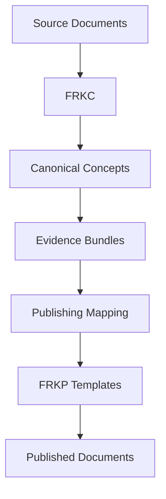

# Publishing Readiness Report

## Layer Readiness

| Layer | Ready | Documents | Mapped | Reason |
| ----- | ----- | --------- | ------ | ------ |
| RL | YES | 6 | 6 | All layer documents have traceable canonical/evidence mappings. |
| KB | YES | 13 | 13 | All layer documents have traceable canonical/evidence mappings. |
| AN | YES | 5 | 5 | All layer documents have traceable canonical/evidence mappings. |
| MF | YES | 6 | 6 | All layer documents have traceable canonical/evidence mappings. |
| FC | YES | 24 | 24 | All layer documents have traceable canonical/evidence mappings. |
| IMP | YES | 4 | 4 | All layer documents have traceable canonical/evidence mappings. |
| ARCH | YES | 6 | 6 | All layer documents have traceable canonical/evidence mappings. |
| BUNDLE | YES | 6 | 6 | All layer documents have traceable canonical/evidence mappings. |

## Future Publishing Model

## Validation

| Check | Result |
| ----- | ------ |
| Every FRKP document has a mapping where evidence exists | PASS |
| Every canonical concept maps to zero or more FRKP documents | PASS |
| Every mapping is traceable | PASS |
| No circular mappings | PASS |
| No duplicate mappings | PASS |
| No broken references | PASS |
